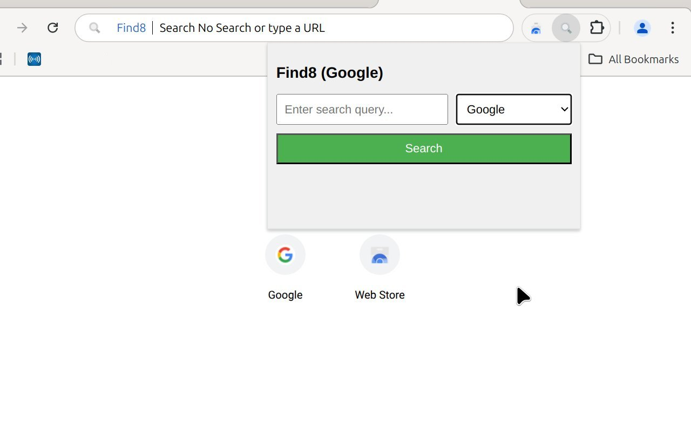

# Find8

Easily search across multiple search engines from a single interface. Provides a seamless and efficient way to add newly discovered search engines to further explore online information.

---

---

## Features
- Search across Brave, Google, Bing, DuckDuckGo, YouTube, more will be added soon.
- Quickly switch between engines using a dropdown menu
- Compact popup UI for quick access
- **Omnibox support:** search straight from the address bar

- **Automatically** suggests adding newly discovered search engine. 

Custom Search Behavior: Supports flexible configurations to match your preferences.

---

## Screenshot

---

## Usage

1. Click the Find8 icon in your browser toolbar
2. Enter your search query
3. Choose a search engine
4. Hit "Search" — results open in a new tab

Or just type `8` in your address bar for instant omnibox access.
And then enter a keyword:
- `y cats` → YouTube search
- `g openai` → GitHub search
- `b privacy` → Brave search
- `w AI` → Wikipedia
- `s chrome extension` → Stack Overflow
- Anything else → defaults to Google

---

## Installation

### From the Chrome Web Store
Install directly:  
[**→ Find8 on Chrome Web Store**](https://chromewebstore.google.com/detail/find8/podlebodapccbabemoihfnpfhebfoogf?authuser=0&hl=en&pli=1)

### From GitHub Releases
1. Download if available `.crx` file from the [Releases page](https://github.com/appcod8/find8/releases)
2. Go to `chrome://extensions/` or `brave://extensions/`
3. Enable **Developer Mode**
4. Drag and drop the `.crx` file

### Load Unpacked (Dev mode)
1. Clone the repo:
2. Go to your browser’s `extensions` page
3. Enable **Developer Mode**
4. Click **Load unpacked**, and select the folder

---

## Philosophy

This project is free and open—not monetized, not tracking you, and not tied to any corporate interest.  
Built to prioritize **privacy, simplicity, and function over profit**. Feedback, forks, or ideas are always welcome.

---

## License

[MIT License](https://mit-license.org/)

---

## Support This Project

If you find Find8 useful and want to support its continued development, you can send a small tip (no platforms, no middlemen):
**Monero (XMR) donations welcome:** `45dQBvK6d1cdgfs1vVPc4Y7WBRBPuZDRV9E2tUxwdckST7TBDjMm54Zbkxvwiq7qj72u4k4LQSfkUgMADFXS1HsPGvw5Bxo`

 
Thank you for using and supporting privacy-first tools.

